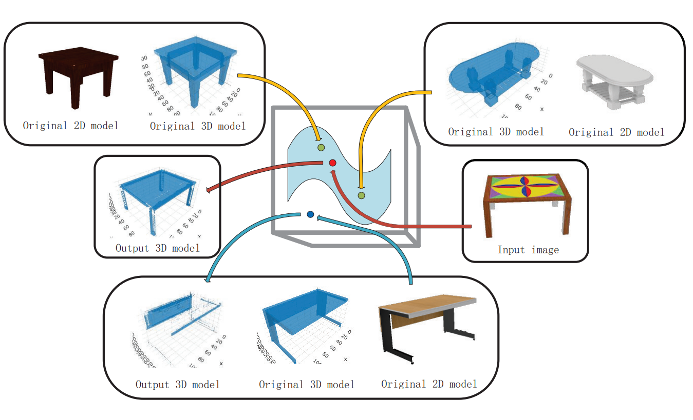
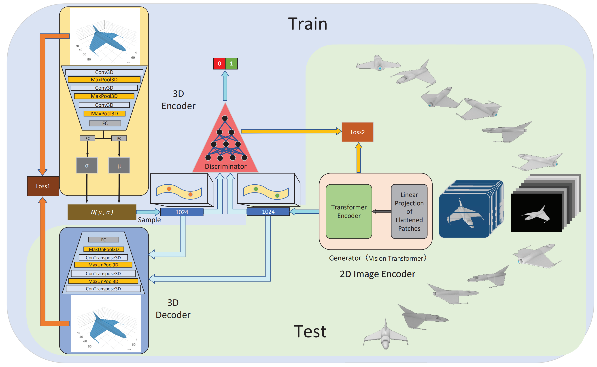
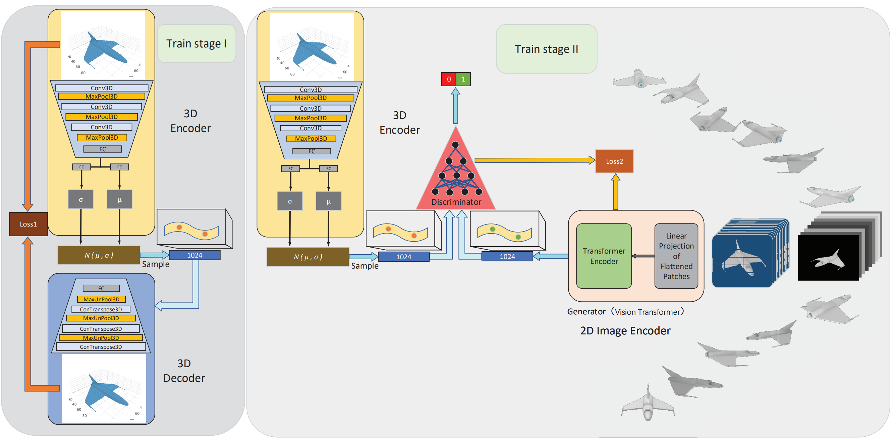
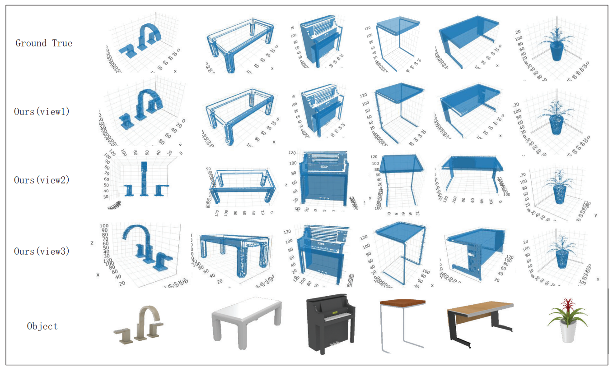

# PyTorch implementation of 3D-VGT(3D-VAE-GAN-Transformer)

This repository contains the source code for the paper "3D reconstruction method based on
a generative model in continuous latent space"  

#### Author email: gaotong_dream@foxmail.com    


  




## Datasets
We use the renderings of [ShapeNet](https://www.shapenet.org/) in our experiments,which are available below:
- ShapeNet rendering images: https://www.shapenet.org/
## Model Structure


## train stage



## Prerequisites
#### Clone the Code Repository

```
git clone https://github.com/clfs0003/3D-VGT
```
#### Install Python Denpendencies

```
cd 3D-VGT
pip install -r 3D-VGT_requirements.txt
```
#### Update Settings in `config.py` of part1 

You need to update hyperparametersthe of the model and path of the datasets :
```
    parser.add_argument('--img_dir', type=str, default='../dataset/shapenet/train_imgs', help='input images path')
    parser.add_argument('--vox_dir', type=str, default='../dataset/shapenet/train_voxels', help='input voxels path')
    parser.add_argument('--lr', type=float, default='0.0002', help='learning rate')
    parser.add_argument('--batch_size', type=int, default='32', help='batch_size in training')
    parser.add_argument("--epoch", type=int, default=500, help="epoch in training")
```

## Part of the experimental results are as follows
results of ShapeNet:



## Get Started
To train UAGAN, you can simply use the following command:
  
stage 1
```
cd 3D-VGT
cd part1
python3 main_part1.py
```
stage 2
```
cd 3D-VGT
cd part2
python3 main_part2.py
```

Note:
Since our paper has not been published yet, we only show the model structure and training code. When the paper is published, we will publish the full work of the paper.
Welcome scholars to discuss and exchange.

## License

This project is open sourced under MIT license.
